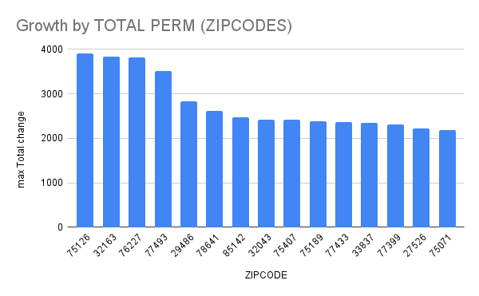

# FOIA_COA_2022
## Excel/Google Sheets Analysis of COA USPS requests

This is an analysis of COA (Change of Address) requests made to the USPS (United States Postal Service) during the year of 2022. 
In this analysis we attempt to answer two questions primarily, and we explore two questions secondarily. Namely: we are curious about the which zip codes had the most people moving to them, and which had the most moving away from them. After we answer these questions, we briefly explore the same format questions, but with regards to states.

This analysis could be useful to real-estate agents and business development analysts who are seeking where to expand to next.

## Data Acquisition and Analysis

Initially we downloaded the file from the [USPS website](https://about.usps.com/who/legal/foia/documents/change-of-address-stats/Y2022.csv). After uploading to google sheets, we evaluated the data and [USPS's documentation](https://about.usps.com/who/legal/foia/documents/change-of-address-stats/coa-stats-explanation.pdf) to understand how we could best understand our question. We note that we are only interested in permanent residential changes, i.e., we want to know where people are settling and not where they are temporarily staying for reasons other than long-term residential plans. Thusly we know that we are interested in three columns primarily: ZIPCODE, and the two TOTAL PERM columns. We are interested in both 'TOTAL PERM' columns for two reasons: 1) we do not want to count people or businesses who are moving within the same zipcode as people who are moving to the zipcode freshly 2) We want to show growth within a community and not necessarily an equal exchange of residents or businesses. If the same number of people moving into a zipcode are also moving out of a zipcode, then there is no obvious growth potential for businesses, though there may be *some* for real estate agents.

We can now discern a formula from which we can calculate the approximate growth in a zip code by COA requests: 
$$\sum_{k=1}^{12} ({c_i}_k - {b_i}_k) = Z_i,\ \forall i,\  i \in ZIPCODES$$

We then create a new tab on the sheets document and composed the following code: 
```
=QUERY(COA_2022!A1:P500000, "select B, SUM(I), SUM(O) GROUP BY B ORDER BY SUM(I) DESC", 1).
```
This query generated for us three columns, the zipcode, a summation of every TOTAL PERM moving from that zipcode, and a summation of every TOTAL PERM moving to that zipcode. We then created a fourth column that subtracted the total number of COA requests moving to a zipcode permanently as a resident, from the total number of COA requests moving from a zipcode permanently as a resident.

From there we generated the following pairs of code: 
```
=QUERY(YTD_ZIP!A1:D30000, "SELECT A, max(D) where D is not null GROUP BY A ORDER BY max(D) DESC LIMIT 15",1), 
=QUERY(YTD_ZIP!A1:D30000, "SELECT A, max(D) where D is not null GROUP BY A ORDER BY max(D) ASC LIMIT 15",1).
```
These are the same code, excepting whether they are ascending or descending in value, i.e., whether we are looking at the greatest values or the smallest values. We then generated the following charts from the results of the queries, showing the zipcodes with the greatest growth and the greatest shrinkage, respectively.



